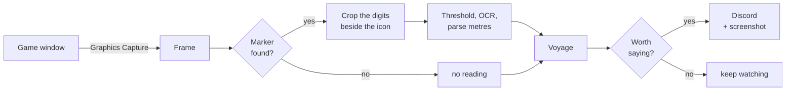
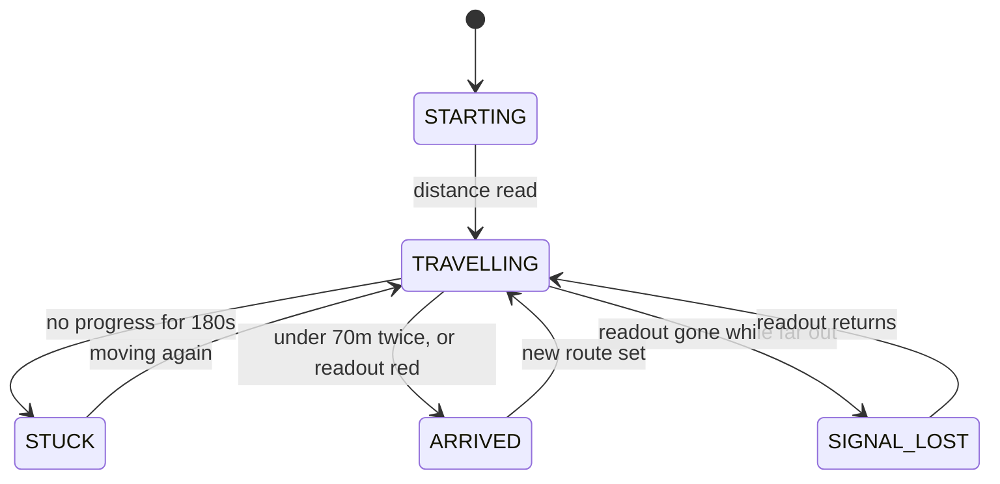

<div align="center">

# ⛵ BDO Autoroute Track

**Stop alt-tabbing every ten minutes to check whether you've arrived.**

Watches the remaining-distance readout on Black Desert Online's auto-route marker
and pings your phone — with a screenshot — the moment you **arrive**, get
**stuck** on terrain, or **lose the route**.

[](LICENSE)
[](https://www.python.org/)
[](#requirements)
[](https://github.com/delCatta/bdo-autoroute-track/actions/workflows/tests.yml)
[](#scope-and-safety)

</div>

---

```
09:04:12  TRAVELLING   distance=3970m   eta=18m 20s  stalled=0s
09:09:41  TRAVELLING   distance=1480m   eta=6m 43s   stalled=0s
09:10:11  TRAVELLING   distance=1480m   eta=-        stalled=30s
09:11:12  STUCK        distance=1480m   eta=-        stalled=3m 0s   ->  phone buzzes
```

Works for **any** auto-route. Barter voyages are what it was built for, but the
marker is the same one land auto-pathing uses.

## What you actually get

| | When | Buzzes your phone |
|---|---|---|
| **Arrived** | distance under 70m, confirmed twice | yes |
| **Approaching destination** | first drop under 500m, or the readout turns red | yes |
| **Progress has stalled** | 60s without progress | yes |
| **Looks stuck** | 180s without progress, then nags | yes |
| **Lost sight of the route** | marker gone while still far out — crash, disconnect | yes |
| **Still under way** | every minute, once 150m has actually been covered | no |

Alerts go to **Discord**, a **Windows toast**, or both — `notify.channels`
picks. Leave the webhook blank and desktop notifications work with no setup at
all. Each alert carries a screenshot of the moment it fired.

### Run it from the tray

```powershell
.	ray.cmd
```

The icon **changes colour with the state** - blue under way, orange stalled, red
lost, green arrived, grey when muted or paused - so a glance at the tray answers
"how is it going?" without opening anything. Hover for the full picture:

```
BDO Autoroute Track
Looks stuck - 3170m remaining
No progress for 3m 5s
checked 11:28:44
```

Right-click for state, **mute notifications**, **pause watching**, **Settings**,
open the logs folder, and quit. `run.cmd` is the same monitor in a console.

## Quick start

```powershell
.\setup.cmd        # venv + dependencies
                   # then paste your Discord webhook into config.toml
.\calibrate.cmd    # drag a box round the digits, then the icon
.\run.cmd          # go AFK
```

> **Use the `.cmd` files, not the `.ps1` ones.** Windows ships PowerShell's
> execution policy as `Restricted`, so `.\setup.ps1` fails with *"running scripts
> is disabled on this system"*. Each `.cmd` is a two-line wrapper that runs its
> `.ps1` with `-ExecutionPolicy Bypass` for that one call. It changes nothing
> about your system.

### Requirements

- **Windows 10/11** — it reads the screen, and window capture uses the Windows
  Graphics Capture API
- **Python 3.11 or 3.12** — `winget install -e --id Python.Python.3.12`.
  Not 3.13: the OCR engine has no wheel for it yet. Windows also ships a Store
  stub that cannot make venvs, which `setup.cmd` detects and rejects.
- **Black Desert in Borderless Windowed** — Fullscreen Exclusive returns black frames

## How it works

One number tells you everything. Read it every 30 seconds and the whole picture
falls out of it.





<details>
<summary><b>Three things about the game that shaped the whole design</b></summary>

<br>

All three were learned by watching the real client, and each one killed an
assumption the first version made.

**The marker moves.** It is anchored to a world position, so it slides around the
screen as the camera turns. A fixed crop box cannot work. Instead the route icon
is template-matched across the whole frame every poll, and the digits are read
from a box positioned *relative to wherever the icon turned up*.

**The text turns red near the destination.** Red has a *luminance* around 105, so
any brightness threshold that keeps white text (232) drops red text entirely —
going blind at the exact moment arrival matters most. Thresholding is done on the
**max colour channel** instead (white ~232, red ~230, both kept), and the red
state doubles as a positive near-arrival signal.

**The number does not reliably reach zero.** It can stop in the seventies, or just
vanish. So arrival triggers at 70m or below, and a readout that disappears right
after turning red counts as arrival rather than a lost signal.

</details>

<details>
<summary><b>Guarding against misreads — every one of these was seen live</b></summary>

<br>

OCR on a small stylised game font fails in specific, repeatable ways. Each of
these cost a real bug:

| Seen | True value | Fix |
|---|---|---|
| `11'69 9` | 1169m | Apostrophes are thousands separators; the parser takes the run with the **most digits**, not the right-most |
| `1400` | **14000** | The digits box preserved a calibration-time gap to the icon. That gap shrinks as the number grows, clipping the last digit — a 10x error. The box now hugs the icon |
| `/40` | 740m | Threshold 150 clipped thin strokes and dropped the leading `7`. Over the same 10 crops: threshold **120** gave 0 anomalies, 150 gave 3 |
| `480` / `1480` / `480` ... | 1480m | A dropped leading digit made every flip look like a kilometre of progress, resetting the stall timer so `STUCK` could never fire |

Two structural defences came out of that last one:

- **Arrival needs two consecutive** sub-threshold readings. A lone misread of `9`
  would otherwise announce "you have arrived" while you were a kilometre out —
  the worst possible failure, because you stop paying attention.
- **A jump no route could travel is held** until a second reading agrees with it.
  Real route changes confirm on the next poll; a flicker never does, so it never
  moves the baseline.

Stall is measured against the *best distance ever reached*, not the previous
reading, so jitter and drift cannot masquerade as movement.

</details>

<details>
<summary><b>Capture: the window, not the screen</b></summary>

<br>

Frames come from the game window itself via **Windows Graphics Capture** — what
OBS calls Window Capture. Anything stacked on top of the game never appears in
the frame, so you can use the PC while it runs.

Measured live with windows covering the game: **50.9% of the frame differed**
between the two backends. Window capture read the marker at 0.948 confidence;
screen capture could not find it at all.

`PrintWindow` does not work here — it returns an all-black frame for the Black
Desert client, as it does for most DirectX games. Verified, not assumed.

**Minimising.** Black Desert does not minimise like a normal window:

```
Ordinary window   IsIconic=True   client 0x0        rect (-32000,-32000)
Black Desert      IsIconic=FALSE  client 3440x1440  rect (0,0,3440,1440)
                  ...but it drops out of the visible window enumeration
```

So the usual checks never fire for it. Because the game keeps a valid rect while
hidden, capture is *attempted* rather than refused on principle — only a missing
frame proves it cannot be read. If it cannot, you get a `SIGNAL_LOST` alert naming
the real reason: it fails loudly rather than going quietly blind.

**Which window?** The game is found by its **process**, not its title. Three
windows can answer to "Black Desert" at once — a Discord server called
*Black Desert - Sailing*, a browser tab about the game, and the game itself — and
Windows enumerates them front-to-back. Taking the first title match meant that
alt-tabbing to read an alert started screenshotting Discord. `.\shot.cmd` and
`bdo_autoroute windows` both show the owning process of every candidate.

`capture.method = "screen"` grabs the desktop rectangle instead, and is the
automatic fallback if Graphics Capture is unavailable. The two backends render
colours slightly differently — a template cut under one scored 0.86 under the
other, right on the threshold — so **re-run calibrate if you change it**.

</details>

## Setup

<details>
<summary><b>Discord webhook</b></summary>

<br>

*Channel → Edit Channel → Integrations → Webhooks → New Webhook → Copy URL*, then
paste it into `config.toml` as `notify.discord_webhook_url`. A private channel in
your own server is fine, and Discord's mobile push is what reaches your phone.

Set `notify.mention` to `<@your-user-id>` so alerts actually buzz rather than
sitting silently in the channel. Enable Developer Mode in Discord
(*Settings → Advanced*), then right-click yourself and Copy User ID.

A webhook is bound to the channel it was made in. To move it, edit it in Discord
— the URL stays the same.

</details>

<details>
<summary><b>Calibrating</b></summary>

<br>

Start an auto-route so the marker is on screen, then `.\calibrate.cmd`. You will
be asked for two boxes:

1. **The distance digits** — just the number. Not the icon.
2. **The icon beside them** — box it tightly; this becomes the template used to
   find the marker as it moves.

Calibration then re-finds the marker, reads it back, and **measures the match
threshold for you**: it blanks the marker, re-matches to find the scenery noise
floor, and warns if `marker.match_threshold` sits too close to it. On a real
3440x1440 frame the marker scores 1.00 and scenery tops out near 0.72 — which is
why the default is 0.85 and not something lower. Set it too low and deck texture
gets mistaken for the marker, and a fabricated distance is reported.

If the reading fails, open `debug/stencil.png` — the exact black-on-white image
the OCR engine receives:

- digits faint or broken up: **lower** `ocr.brightness_threshold`
- background bleeding in as black smears: **raise** it
- digits tiny: raise `ocr.upscale`

Calibration is stored as an icon template plus an offset, never screen
coordinates, so it survives the camera moving and the window being dragged.
Re-run it after any resolution, UI-scale or `capture.method` change.

</details>

## Running

Double-click the **BDO Autoroute Track** shortcut, or:

```powershell
.\run.cmd              # start watching
.\run.cmd --once       # a single poll
.\run.cmd --log        # ...and record it to logs/autoroute.log
.\shot.cmd             # one look: where the marker is, what it reads
.\test-notify.cmd      # prove the webhook works before relying on it
```

`.\install-shortcut.cmd` creates the desktop shortcut, `-Remove` deletes it.

## Tuning

Everything lives in `config.toml`, and every value is commented.

| Setting | Default | Notes |
|---|---|---|
| `window.process_matches` | `["BlackDesert64.exe"]` | How the game is identified. Titles are only the fallback |
| `capture.method` | `window` | `window` = game only; `screen` = desktop rectangle |
| `capture.poll_interval_seconds` | `30` | Keep well under `stalling_after_seconds` |
| `detect.arrival_threshold_m` | `70` | The number does not reliably reach 0 — do not set this near it |
| `detect.arrival_confirm_polls` | `2` | Consecutive sub-threshold readings before declaring arrival |
| `detect.approaching_m` | `500` | One-off early warning as the destination comes into range |
| `detect.stalling_after_seconds` | `60` | One-off early warning, well before confirmed stuck |
| `detect.stuck_after_seconds` | `180` | Confirmed, nagging stuck |
| `marker.match_threshold` | `0.85` | Must sit above the scenery floor (~0.72); calibration checks this |
| `ocr.brightness_threshold` | `120` | 150 clipped leading digits; measured |
| `notify.channels` | `["discord", "desktop"]` | Where alerts go. Unbuildable channels are skipped with a warning |
| `notify.screenshot` | `full` | `full`, `marker` (crop, no chat) or `none` |
| `notify.heartbeat_minutes` | `1` | Routine screenshot, at most this often |
| `notify.heartbeat_min_progress_m` | `150` | ...and only after this much real progress |
| `logging.to_file` | `false` | `--log` forces it on for one run |
| `storage.retain_days` | `7` | Age at which `captures/` and `debug/` are cleared |

## What leaves your machine

A **`full`** screenshot is the whole game window — which includes whispers,
guild chat, your character name and the marketplace. That is exactly what you
want in your own private Discord channel, and exactly what you do not want in a
shared guild server.

```toml
[notify]
screenshot = "marker"   # just the readout and a little context
```

On a 3440×1440 window that is the difference between sending 3440×1440 and
**721×112**. `none` sends text only. Nothing else leaves the machine: no
telemetry, no analytics, and the samples archive stays local.

**The webhook is a bearer credential** - anyone holding that URL can post to
your channel. Saving from Settings encrypts it against your Windows account
using DPAPI, and `.\.venv\Scripts\python.exe -m bdo_autoroute protect`
encrypts one already in `config.toml`. Encrypted values start with `enc:` and
are useless on another machine or under another Windows user, so a config that
gets zipped or synced carries nothing usable. It does **not** protect against
something already running as you.

## Housekeeping

**Logging to a file is off by default.** Turn it on with `--log`, or set
`logging.to_file = true`. It records every poll with full timestamps — whether or
not an alert fired — rotating at `max_mb` across `keep_files`. Intermittent
misreads are the hard ones, and they are only diagnosable against a record.

`captures/` and `debug/` are working files, cleared after `storage.retain_days`.

`samples/` is different: a small, permanent, labelled archive kept for training
later, never pruned. Sampling is **biased towards failures**, because a thousand
clean reads of "600" teach a model nothing while one misread teaches it plenty.

| Category | What lands here |
|---|---|
| `unparsed` | marker found, no number readable |
| `no_marker` | nothing matched — negative examples, downscaled |
| `low_confidence` | matched only just above the threshold |
| `red` | the near-arrival red text: rare, easy to get wrong |
| `ordinary` | clean reads, throttled to one per `sample_every_minutes` |

Each sample is a PNG plus a JSON sidecar with the raw OCR text, parsed value, red
ratio, match confidence and boxes — enough to re-label later without guessing.

## Tests

```powershell
.\.venv\Scripts\python.exe -m pip install -r requirements-dev.txt
.\.venv\Scripts\python.exe -m pytest
```

264 tests. Time is a parameter to the state machine, so whole voyages replay
instantly — jitter, recovery from stuck, new routes, dropped readings, red-text
arrival, and every OCR misread seen live.

## Scope and safety

This tool is **strictly read-only with respect to the game**. It:

- takes screenshots of a window, the same way OBS does
- **never** reads the game's memory
- **never** injects a DLL or hooks the process
- **never** sends a keystroke, click, or any other input

It observes and tells you things. It does not play for you. Pearl Abyss's
enforcement is aimed at macros and botting — programs that automate *input* —
which is a different category from this.

> **That said: no third-party tool is officially sanctioned, and you use this at
> your own risk.** Nobody here can promise how Pearl Abyss will treat any given
> program, and account actions are theirs to take. If that risk is not acceptable
> to you, do not run it. Please do not add input automation to a fork under this
> name — that would put users in a genuinely different category of risk.

Not affiliated with, endorsed by, or connected to Pearl Abyss. "Black Desert
Online" and its assets belong to them. **No game files or artwork ship in this
repository** — `icon_template.png` is generated on your own machine by
`calibrate.cmd` from your own screen, and is gitignored.

## Contributing

Issues and PRs welcome, particularly:

- **Resolutions other than 3440x1440.** The scaling code exists but is untested.
- **The dropped leading digit.** Still unfixed at the OCR level; the state
  machine merely refuses to act on it. Run with `--log` and send `samples/`.
- **Non-English clients**, where the readout may differ.

Run `pytest` before opening a PR. If you are changing how frames are captured or
read, **read [.claude/CONTEXT.md](.claude/CONTEXT.md) first** — it documents several assumptions
that look obviously correct and are provably wrong.

## Prior art

Nobody had built this; the pieces existed separately.

| Project | Why it is not this |
|---|---|
| [BDO Life Companion](https://github.com/kurohige/BdoLifeCompanion-Pub) | Barter tracking, but manual entry — it explicitly does not read screen or memory |
| [BDO Loot Tracker](https://github.com/janhnguyen/BDO-Loot-Tracker) | OCR overlay, but reads loot, not navigation |
| [BDO Barter Inventory Bot](https://github.com/pmazumder3927/BDO-Barter-Inventory-Bot) | One-shot inventory screenshot, no monitoring loop |
| [BDO Boss Alerts](https://github.com/Hermitter/BDO-Boss-Alerts) / [BDO-Alerts](https://github.com/LoadingMagic/BDO-Alerts) | Global server events, never your character |

Ships snagging on auto-path is a long-standing, documented problem —
[BDFoundry](https://www.blackdesertfoundry.com/global-lab-updates-10th-april-2026/)
records Pearl Abyss relocating objects around Star of Margoria because of it, and
[GrumpyG's sailing FAQ](https://grumpygreen.cricket/bdo-sailing-faq-for-beginners/)
still advises checking back manually every ten minutes.

## Layout

```
src/bdo_autoroute/
  window.py       the game window; window or screen capture (read-only)
  marker.py       Marker, Sighting, Box, Offset - finding the moving marker
  readout.py      Readout, Reading, Glyphs - crop to a number
  observation.py  Observation - what one look at the screen amounts to
  voyage.py       Voyage, Progress, State - readings to a state
  alerts.py       Alert - what gets said, and how loudly
  discord.py      Discord - delivery, and nothing about routes
  archive.py      Archive - expire working files, curate training samples
  picker.py       Picker - dragging the two calibration boxes
  monitor.py      Monitor - the polling loop
  commands.py     one function per CLI verb
  cli.py          argument parsing and dispatch
```

<div align="center">

**[MIT licensed](LICENSE)** — built for people who would rather be doing something else while the boat sails.

</div>
