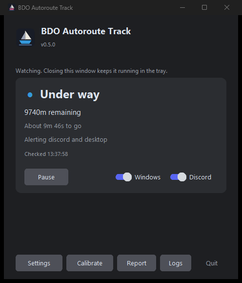
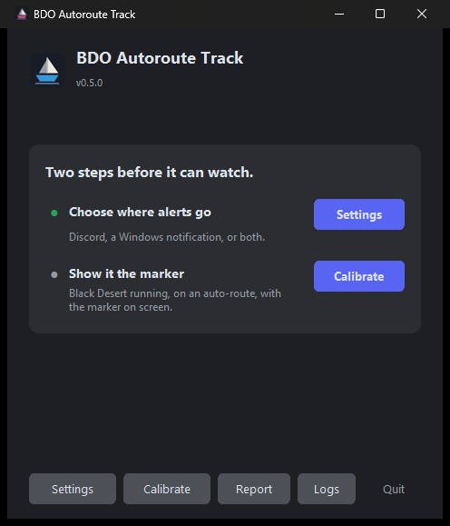
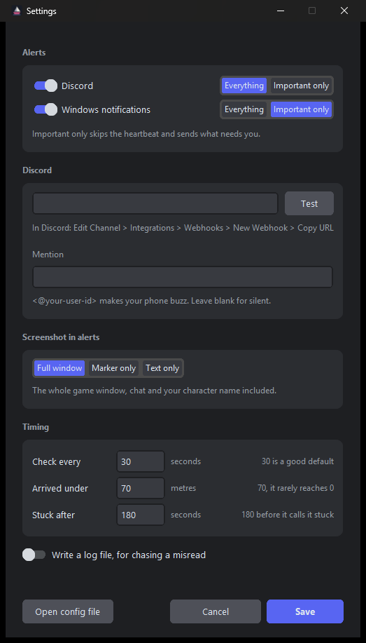

<div align="center">


**[Install](#install)** · **[Quick start](#quick-start)** · **[How it works](docs/how-it-works.md)** · **[Contributing](CONTRIBUTING.md)** · **[Changelog](CHANGELOG.md)**

[](LICENSE)
[](https://github.com/delCatta/bdo-autoroute-track/releases/latest)
[](https://github.com/delCatta/bdo-autoroute-track/releases)
[](https://github.com/delCatta/bdo-autoroute-track/stargazers)
[](https://github.com/delCatta/bdo-autoroute-track/actions/workflows/tests.yml)
[](#install)

</div>

---

I work remote from home, and I kept losing profit to the same two things, a
barter boat snagged on terrain going nowhere for twenty minutes, or one that
arrived while I was in a meeting and just sat there.

So I built this. It watches the auto-route marker and tells me the moment either
happens. I hope it helps you too.

```
09:04:12  TRAVELLING   distance=3970m   eta=18m 20s  stalled=0s
09:09:41  TRAVELLING   distance=1480m   eta=6m 43s   stalled=0s
09:10:11  TRAVELLING   distance=1480m   eta=-        stalled=30s
09:11:12  STUCK        distance=1480m   eta=-        stalled=3m 0s   ->  phone buzzes
```

- **Arrived, stuck, or route lost.** Plus a heads-up at 500m out and after 60s
  of no progress, while you can still do something about it.
- **Discord, a Windows notification, or both.** Each channel hears as much as
  you want, so toasts stay rare while your phone gets the running commentary.
- **Read-only.** It screenshots the game window the way OBS does. No memory
  reads, no injection, no synthesised input.
- **Any auto-route.** Land auto-pathing uses the same marker as boats.

## What it looks like

<div align="center">

&nbsp;&nbsp;

</div>

<div align="center">

</div>

Left is a route under way. Right is a fresh install, and those two buttons are
the whole set-up.

## Install

**[Download the installer](https://github.com/delCatta/bdo-autoroute-track/releases/latest)**
(`BDO-Autoroute-Track-Setup-<version>.exe`) and run it. There is no Python to
install and no console window. It installs for your user only, so no admin
prompt either.

Needs Windows 10 or 11 and Black Desert in **Borderless Windowed**.

> SmartScreen will say "Windows protected your PC" the first time, because the
> installer is not signed yet. Click **More info**, then **Run anyway**. CI
> builds it from the tagged commit in this repo, and the checksum is on the
> release page.

## Quick start

The window opens with two steps.

1. **Settings.** Where alerts go. Windows notifications need nothing. For
   Discord, paste a webhook URL and press **Test**.
2. **Calibrate.** With the game on an auto-route, drag a box around the distance
   number, then one around the icon beside it. Once, unless you change
   resolution.

Then it watches. Closing the window leaves it running in the tray, where the
boat changes colour with the state. Right-click the boat for the switches,
double-click it for the window.

Saved settings apply without a restart. Everything the program writes (config,
calibration, log) lives in `%LOCALAPPDATA%\BDO Autoroute Track`, and updating
or uninstalling leaves that folder alone.

**The marker has to be visible.** Point the camera down so it sits mid-screen,
away from the quest tracker and the buff bar. The world map and the Barter
Information panel hide it. The game does not need to be focused or in front.

To run it from source instead, see [CONTRIBUTING.md](CONTRIBUTING.md).

## Before you point it at a shared server

A `full` screenshot is the whole game window, whispers and guild chat included.
Fine in your own channel, not in a guild one.

```toml
[notify]
screenshot = "marker"   # just the readout: 721x112 instead of 3440x1440
```

The webhook is a bearer credential, so Settings encrypts it against your
Windows account before saving. A copied `config.toml` carries nothing usable.
Nothing else leaves the machine. No telemetry, and the sample archive stays
local and follows the same `screenshot` setting.

## Scope and safety

Read-only with respect to the game. It observes and tells you things. It does
not play for you, and Pearl Abyss's enforcement is aimed at programs that
automate input.

> **No third-party tool is officially sanctioned, and you use this at your own
> risk.** Nobody here can promise how Pearl Abyss will treat any given program.
> If that risk is not acceptable to you, do not run it.

Not affiliated with, endorsed by, or connected to Pearl Abyss. "Black Desert
Online" and its assets belong to them, and no game files are redistributed.

## Known limitations

- **Resolution changes break template matching.** Recalibrate at your
  resolution. The tool tells you when this is the problem.
- **OCR occasionally drops a leading digit.** The state machine refuses to act
  on it, so it cannot cause a false arrival, but a reading can still be wrong.
- `stuck_after_seconds = 180` is tuned from a single real observation.

## Contributing

You do not need to write code. The three worst bugs here were found by someone
looking at real output and saying "that seems off". Your resolution, a log of a
dropped leading digit, or a non-English client are the most useful things right
now. See [CONTRIBUTING.md](CONTRIBUTING.md).

## Docs

- **[How it works](docs/how-it-works.md)**, the pipeline, every OCR misread and
  its fix, calibration, tuning
- **[Changelog](CHANGELOG.md)**
- **[Engineering context](.claude/CONTEXT.md)**, read before changing capture,
  the marker, OCR, or the state machine

<div align="center">

**[MIT licensed](LICENSE)**, built for people who would rather be doing something else while the boat sails.

</div>
