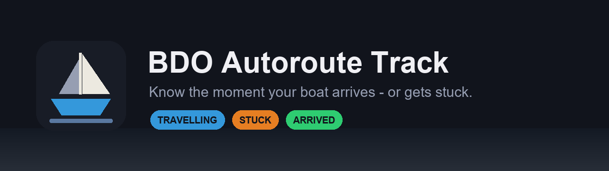

<div align="center">



**[Install](#install)** · **[Quick start](#quick-start)** · **[How it works](docs/how-it-works.md)** · **[Contributing](CONTRIBUTING.md)** · **[Changelog](CHANGELOG.md)**

[](LICENSE)
[](https://github.com/delCatta/bdo-autoroute-track/releases/latest)
[](https://github.com/delCatta/bdo-autoroute-track/releases)
[](https://github.com/delCatta/bdo-autoroute-track/stargazers)
[](https://github.com/delCatta/bdo-autoroute-track/actions/workflows/tests.yml)
[](#install)

</div>

---

I work remote from home, and I kept losing profit to the same two things: a
barter boat snagged on terrain going nowhere for twenty minutes, or one that
arrived while I was in a meeting and just sat there.

So I built this. It watches the auto-route marker and tells me the moment either
happens. I hope it helps you too.

```
09:04:12  TRAVELLING   distance=3970m   eta=18m 20s  stalled=0s
09:09:41  TRAVELLING   distance=1480m   eta=6m 43s   stalled=0s
09:10:11  TRAVELLING   distance=1480m   eta=-        stalled=30s
09:11:12  STUCK        distance=1480m   eta=-        stalled=3m 0s   ->  phone buzzes
```

- **Tells you the moment it matters** — arrived, stuck on terrain, or the route
  lost to a crash. Plus early warnings at 500m out and 60s of no progress, while
  you can still do something about it.
- **Discord, Windows toast, or both.** Leave the webhook blank and desktop
  notifications work with no setup at all.
- **Lives in the tray.** The icon changes colour with the state, so a glance
  answers "how's it going?". Mute, pause, or change settings from the menu —
  changes apply without restarting.
- **Notices its own failures.** Three delivery failures in a row say so loudly.
  A monitor that has quietly stopped notifying looks exactly like one with
  nothing to report.
- **Read-only.** Screen capture only — never memory reads, never injection,
  never a synthesised keystroke.
- **Any auto-route**, not just boats: it is the same marker land auto-pathing
  uses.

## Install

**[Download the latest release](https://github.com/delCatta/bdo-autoroute-track/releases/latest)**
→ extract the ZIP anywhere → run `setup.cmd`. No git required.

Needs **Windows 10/11**, **Python 3.11 or 3.12** (`winget install -e --id
Python.Python.3.12` — not 3.13, the OCR engine has no wheel for it), and Black
Desert in **Borderless Windowed**.

> **The marker has to be visible.** Everything is read from it, so keep it out
> from under the game's own UI — **pointing the camera down** keeps it
> mid-screen and away from the quest tracker and buff bar. Full-screen panels
> like Barter Information or the world map will hide it. You do *not* need the
> game focused or in front; window capture reads its own content.

> Use the `.cmd` files, not the `.ps1` ones. Windows ships PowerShell's execution
> policy as `Restricted`, so `.\setup.ps1` fails with *"running scripts is
> disabled on this system"*. Each `.cmd` runs its `.ps1` with a one-shot bypass
> and changes nothing about your system.

## Quick start

```powershell
.\setup.cmd        # venv + dependencies, then opens Settings
.\calibrate.cmd    # drag a box round the digits, then the icon
.\tray.cmd         # go AFK
```

No TOML editing needed — `setup.cmd` finishes by opening a **Settings** window
for the webhook, where alerts go, and the main thresholds. It is on the tray menu
too. **Saved changes apply to a running monitor straight away**, from the tray,
from `settings.cmd`, or from editing `config.toml` in an editor — nothing needs
restarting.

Other commands: `run.cmd` (same monitor, in a console), `run.cmd --log` (record
this run), `shot.cmd` (one look at what it reads), `test-notify.cmd`,
`settings.cmd`, `install-shortcut.cmd`.

## Before you point it at a shared server

A **`full`** screenshot is the whole game window — whispers, guild chat, your
character name, the marketplace. Perfect for your own private channel, a leak in
a guild one.

```toml
[notify]
screenshot = "marker"   # just the readout: 721x112 instead of 3440x1440
```

**The webhook is a bearer credential.** Saving from Settings encrypts it against
your Windows account with DPAPI, so a `config.toml` that gets zipped or synced
carries nothing usable. It does not protect against something already running as
you.

Nothing else leaves the machine: no telemetry, no analytics, and the sample
archive stays local.

## Scope and safety

This tool is **strictly read-only with respect to the game**. It takes
screenshots of a window the same way OBS does. It never reads the game's memory,
never injects a DLL, and never sends a keystroke or click.

It observes and tells you things. It does not play for you. Pearl Abyss's
enforcement is aimed at macros and botting — programs that automate *input* —
which is a different category from this.

> **That said: no third-party tool is officially sanctioned, and you use this at
> your own risk.** Nobody here can promise how Pearl Abyss will treat any given
> program, and account actions are theirs to take. If that risk is not acceptable
> to you, do not run it.

Not affiliated with, endorsed by, or connected to Pearl Abyss. **No game files or
artwork ship here** — `icon_template.png` is generated on your own machine from
your own screen, and is gitignored.

## Known limitations

- **Resolution changes break template matching.** Recalibrate at your resolution;
  the tool tells you when this is the problem.
- **OCR occasionally drops a leading digit.** The state machine refuses to act on
  it, so it cannot cause a false arrival, but a reading can still be wrong.
- `stuck_after_seconds = 180` is tuned from a single real observation.

## Contributing

**Contributions are wanted, and you do not need to write code to help.** The
three worst bugs in this project were found by someone looking at real output and
saying "that seems off" — never by the test suite.

Most useful right now: **your resolution** (template matching is only proven at
3440×1440), **logs of a dropped leading digit**, and **non-English clients**.

See [CONTRIBUTING.md](CONTRIBUTING.md) for what to send and how to run the tests.

## Docs

- **[How it works](docs/how-it-works.md)** — the pipeline, the three things about
  the game that shaped it, every OCR misread and its fix, calibration, tuning
- **[Changelog](CHANGELOG.md)**
- **[Engineering context](.claude/CONTEXT.md)** — read before changing capture,
  the marker, OCR, or the state machine
- **[Conventions](.claude/CONVENTIONS.md)**

<div align="center">

**[MIT licensed](LICENSE)** — built for people who would rather be doing something else while the boat sails.

</div>
