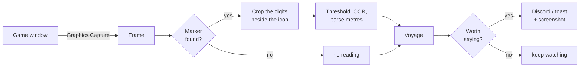
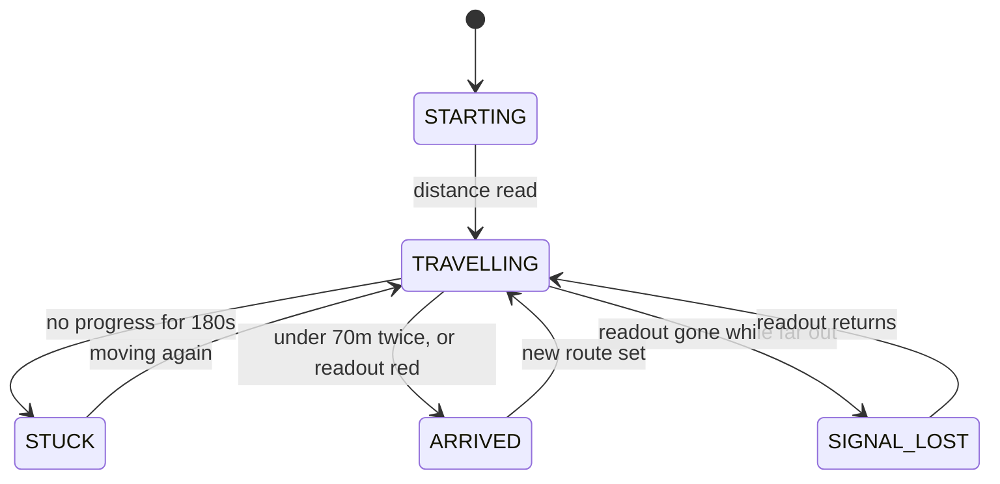

# How it works

One number tells you everything. Read it every 30 seconds and the whole picture
falls out of it.





Two **early warnings** fire before the confirmed states, so you hear about
things while you can still act:

| Notice | When |
|---|---|
| **Approaching destination** | distance first drops under 500m, or the readout turns red |
| **Progress has stalled** | progress first falters for 60s — long before the confirmed `STUCK` at 180s |

Each fires once per route and resets when a new route is set, so they warn
rather than nag.

## Three things about the game that shaped the design

All three were learned by watching the real client, and each one killed an
assumption the first version made.

**The marker moves.** It is anchored to a world position, so it slides around
the screen as the camera turns. A fixed crop box cannot work. Instead the route
icon is template-matched across the whole frame every poll, and the digits are
read from a box positioned *relative to wherever the icon turned up*.

**The text turns red near the destination.** Red has a *luminance* around 105,
so any brightness threshold that keeps white text (232) drops red text entirely
— going blind at the exact moment arrival matters most. Thresholding is done on
the **max colour channel** instead (white ~232, red ~230, both kept), and the
red state doubles as a positive near-arrival signal.

**The number does not reliably reach zero.** It can stop in the seventies, or
just vanish. So arrival triggers at 70m or below, and a readout that disappears
right after turning red counts as arrival rather than a lost signal.

## Guarding against misreads

OCR on a small stylised game font fails in specific, repeatable ways. Each of
these cost a real bug:

| Seen | True value | Fix |
|---|---|---|
| `11'69 9` | 1169m | Apostrophes are thousands separators; the parser takes the run with the **most digits**, not the right-most |
| `1400` | **14000** | The digits box preserved a calibration-time gap to the icon. That gap shrinks as the number grows, clipping the last digit — a 10x error. The box now hugs the icon |
| `/40` | 740m | Threshold 150 clipped thin strokes and dropped the leading `7`. Over the same 10 crops: threshold **120** gave 0 anomalies, 150 gave 3 |
| `480` / `1480` / `480` … | 1480m | A dropped leading digit made every flip look like a kilometre of progress, resetting the stall timer so `STUCK` could never fire |

Two structural defences came out of that last one:

- **Arrival needs two consecutive** sub-threshold readings. A lone misread of `9`
  would otherwise announce "you have arrived" while you were a kilometre out —
  the worst possible failure, because you stop paying attention.
- **A jump no route could travel is held** until a second reading agrees with it.
  Real route changes confirm on the next poll; a flicker never does, so it never
  moves the baseline. A held poll says so in the log:
  `[HELD 3580m: too far to be real, awaiting confirmation]`.

Stall is measured against the *best distance ever reached*, not the previous
reading, so jitter and drift cannot masquerade as movement.

## Capture: the window, not the screen

Frames come from the game window itself via **Windows Graphics Capture** — what
OBS calls Window Capture. Anything stacked on top of the game never appears in
the frame, so you can use the PC while it runs.

Measured live with windows covering the game: **50.9% of the frame differed**
between the two backends. Window capture read the marker at 0.948 confidence;
screen capture could not find it at all.

`PrintWindow` does not work here — it returns an all-black frame for the Black
Desert client, as it does for most DirectX games. Verified, not assumed.

**Which window?** The game is found by its **process**, not its title. Three
windows can answer to "Black Desert" at once — a Discord server called
*Black Desert - Sailing*, a browser tab about the game, and the game itself — and
Windows enumerates them front-to-back. Taking the first title match meant that
alt-tabbing to read an alert started screenshotting Discord.

**Minimising.** Black Desert does not minimise like a normal window:

```
Ordinary window   IsIconic=True   client 0x0        rect (-32000,-32000)
Black Desert      IsIconic=FALSE  client 3440x1440  rect (0,0,3440,1440)
                  ...but it drops out of the visible window enumeration
```

Because the game keeps a valid rect while hidden, capture is *attempted* rather
than refused on principle — only a missing frame proves it cannot be read. If it
cannot, you get a `SIGNAL_LOST` alert naming the real reason.

`capture.method = "screen"` grabs the desktop rectangle instead, and is the
automatic fallback if Graphics Capture is unavailable. The two backends render
colours slightly differently — a template cut under one scored 0.86 under the
other — so **re-run calibrate if you change it**.

## Keeping the marker visible

**Everything depends on the marker being on screen.** It is small — the distance
digits and a route icon beside them, drawn over the world at the destination:

```
                    Balenos
                  Iliya Island
                    2130  [icon]
```

If it is hidden, the tool reports `marker not found`, and after
`detect.missing_confirm_polls` polls it says it has lost the route. It will not
invent a reading, but it cannot watch what it cannot see.

**Point the camera down.** The marker is drawn at a world position, so a low,
downward camera angle keeps it in the middle of the screen and away from the
edges. A flat or upward angle pushes it toward the top of the frame, where the
buff bar, quest tracker and minimap live — and any of those sitting over it will
hide it.

A few things that hide it in practice:

- **Full-screen UI panels.** The Barter Information window, the world map,
  inventory, and the marketplace all cover most of the frame.
- **The top of the screen**, where the quest tracker and notifications appear.
- **The screen edge.** If the marker drifts far enough that the digits fall off
  the frame, the tool says so specifically — the icon is seen but unreadable —
  rather than pretending it is missing.

You do not need the game focused, and you do not need it in front. Window
capture reads the game's own content, so you can work in another window while it
runs. It only needs the marker to be **on the game's own screen**, unobscured by
the game's own UI.

## Calibrating

Start an auto-route so the marker is on screen, then `.\calibrate.cmd`. You will
be asked for two boxes:

1. **The distance digits** — just the number. Not the icon.
2. **The icon beside them** — box it tightly; this becomes the template used to
   find the marker as it moves.

Calibration then re-finds the marker, reads it back, and **measures the match
threshold for you**: it blanks the marker, re-matches to find the scenery noise
floor, and warns if `marker.match_threshold` sits too close to it. On a real
3440×1440 frame the marker scores 1.00 and scenery tops out near 0.72 — which is
why the default is 0.85. Set it too low and deck texture gets mistaken for the
marker, and a fabricated distance is reported.

If the reading fails, open `debug/stencil.png` — the exact black-on-white image
the OCR engine receives:

- digits faint or broken up: **lower** `ocr.brightness_threshold`
- background bleeding in as black smears: **raise** it
- digits tiny: raise `ocr.upscale`

Calibration is stored as an icon template plus an offset, never screen
coordinates, so it survives the camera moving and the window being dragged.
Re-run it after any resolution, UI-scale or `capture.method` change.

## Tuning

Everything lives in `config.toml`, and every value is commented. The settings
window covers the common ones.

| Setting | Default | Notes |
|---|---|---|
| `window.process_matches` | `["BlackDesert64.exe"]` | How the game is identified. Titles are only the fallback |
| `capture.method` | `window` | `window` = game only; `screen` = desktop rectangle |
| `capture.poll_interval_seconds` | `30` | Keep well under `stalling_after_seconds` |
| `detect.arrival_threshold_m` | `70` | The number does not reliably reach 0 |
| `detect.arrival_confirm_polls` | `2` | Consecutive sub-threshold readings before declaring arrival |
| `detect.approaching_m` | `500` | One-off early warning as the destination comes into range |
| `detect.stalling_after_seconds` | `60` | One-off early warning, well before confirmed stuck |
| `detect.stuck_after_seconds` | `180` | Confirmed, nagging stuck |
| `marker.match_threshold` | `0.85` | Must sit above the scenery floor (~0.72); calibration checks this |
| `ocr.brightness_threshold` | `120` | 150 clipped leading digits; measured |
| `notify.channels` | `["discord", "desktop"]` | Unbuildable channels are skipped with a warning |
| `notify.screenshot` | `full` | `full`, `marker` (crop, no chat) or `none` |
| `notify.heartbeat_minutes` | `1` | Routine screenshot, at most this often |
| `notify.heartbeat_min_progress_m` | `150` | ...and only after this much real progress |
| `logging.to_file` | `false` | `--log` forces it on for one run |
| `storage.retain_days` | `7` | Age at which `captures/` and `debug/` are cleared |

## Housekeeping

**Logging to a file is off by default.** Turn it on with `--log`, or set
`logging.to_file = true`. It records every poll with full timestamps — whether or
not an alert fired — rotating at `max_mb` across `keep_files`. Intermittent
misreads are the hard ones, and they are only diagnosable against a record.

`captures/` and `debug/` are working files, cleared after `storage.retain_days`.

`samples/` is different: a small, permanent, labelled archive kept for training
later, never pruned. Sampling is **biased towards failures**, because a thousand
clean reads of "600" teach a model nothing while one misread teaches it plenty.

| Category | What lands here |
|---|---|
| `unparsed` | marker found, no number readable |
| `no_marker` | nothing matched — negative examples, downscaled |
| `low_confidence` | matched only just above the threshold |
| `red` | the near-arrival red text: rare, easy to get wrong |
| `ordinary` | clean reads, throttled to one per `sample_every_minutes` |

Each sample is a PNG plus a JSON sidecar with the raw OCR text, parsed value, red
ratio, match confidence and boxes — enough to re-label later without guessing.

## Prior art

Nobody had built this; the pieces existed separately.

| Project | Why it is not this |
|---|---|
| [BDO Life Companion](https://github.com/kurohige/BdoLifeCompanion-Pub) | Barter tracking, but manual entry — it explicitly does not read screen or memory |
| [BDO Loot Tracker](https://github.com/janhnguyen/BDO-Loot-Tracker) | OCR overlay, but reads loot, not navigation |
| [BDO Barter Inventory Bot](https://github.com/pmazumder3927/BDO-Barter-Inventory-Bot) | One-shot inventory screenshot, no monitoring loop |
| [BDO Boss Alerts](https://github.com/Hermitter/BDO-Boss-Alerts) / [BDO-Alerts](https://github.com/LoadingMagic/BDO-Alerts) | Global server events, never your character |

Ships snagging on auto-path is a long-standing, documented problem —
[BDFoundry](https://www.blackdesertfoundry.com/global-lab-updates-10th-april-2026/)
records Pearl Abyss relocating objects around Star of Margoria because of it, and
[GrumpyG's sailing FAQ](https://grumpygreen.cricket/bdo-sailing-faq-for-beginners/)
still advises checking back manually every ten minutes.

## Layout

```
src/bdo_autoroute/
  window.py       the game window; window or screen capture (read-only)
  marker.py       Marker, Sighting, Box, Offset - finding the moving marker
  readout.py      Readout, Reading, Glyphs - crop to a number
  observation.py  Observation - what one look at the screen amounts to
  voyage.py       Voyage, Progress, State - readings to a state
  alerts.py       Alert - what gets said, and how loudly
  outbox.py       Outbox - fan-out, and noticing a dead channel
  discord.py      Discord - delivery, and nothing about routes
  desktop.py      Desktop - Windows toasts
  archive.py      Archive - expire working files, curate training samples
  vault.py        DPAPI protection for the webhook
  configfile.py   comment-preserving edits to config.toml
  configure.py    the settings window
  icons.py        tray icons, drawn per state
  picker.py       Picker - dragging the two calibration boxes
  tray.py         Tray, Facts
  monitor.py      Monitor - the polling loop
  commands.py     one function per CLI verb
  cli.py          argument parsing and dispatch
```

The engineering context — including every bug found by running against the real
game — is in [.claude/CONTEXT.md](../.claude/CONTEXT.md).
